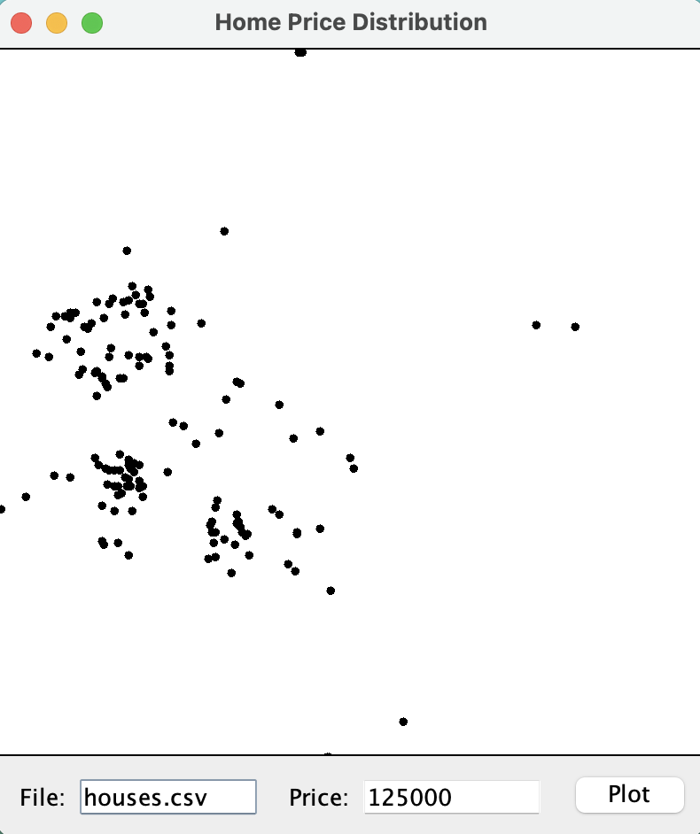

# cheap-houses
> Plots the locations of the houses within a specified price range on a small graphical user interface.

## Table of Contents
* [General Info](#general-information)
* [Technologies Used](#technologies-used)
* [Screenshots](#screenshots)
* [Setup](#setup)
* [Usage](#usage)
* [Project Status](#project-status)
* [Acknowledgements](#acknowledgements)
* [Contact](#contact)

## General Information
This program reads a CSV file that includes the addresses, prices, and latitude/longitude coordinates of houses in a county and then plots the locations of the houses within the specified price range on a small graphical user interface.

## Technologies Used
- Java
- Swing

## Screenshots

## Setup
Ensure you have either dowloaded houses.csv or have another .csv file containing housing price data. 

## Usage
Begin by running CheapHouses.java. Next, in the GUI enter the name of the .csv file containg the housing price data you would like to plot as well as the cut-off price and lastly, press the plot button. 

## Project Status
Project is: _complete_

## Acknowledgements
Give credit here.
- This project was completed as part of coursework for Computer Science 210 - Software Development at the University of Arizona.

## Contact
Created by [@KiranSmelser](https://github.com/KiranSmelser) - please feel free to reach out and contact me!
